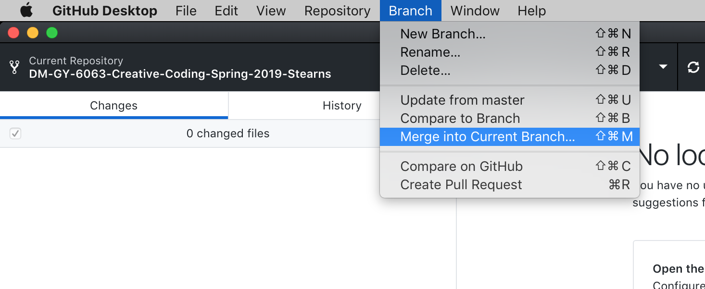
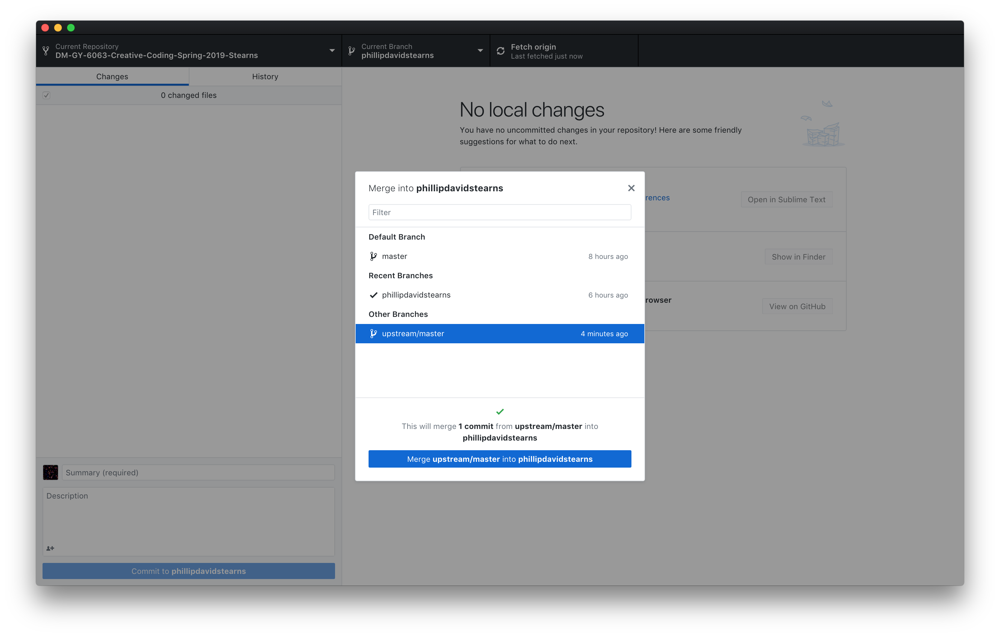
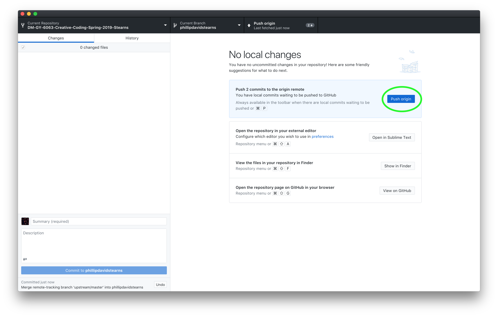

<!-- Begin Marp Formatting -->
<!-- $size: 4:3 -->
<!-- End Marp Formatting -->
# Merging Class Repository Changes

When changes are pushed and merged to the class repository, you'll need to merge them into the working branch of your own Fork. Here are the steps you need to take in order to keep your Fork current with the Class Repository's Master Branch.

---

# 1. Fetch Origin

Update your Fork with the Changes from the Class Repository's Master Branch by clicking Fetch Origin.

---

# 2. Merge into Current Branch

Once fetching is complete, click `Branch` and select `Merge into Current Branch`.

---

# 3. Merge Upstream/Master into Current Branch

This pulls all the changes from the class repository and merges them into your current branch.

---

# 4. Push to Origin

Finally, Push the local commits from the merge to your Fork.

