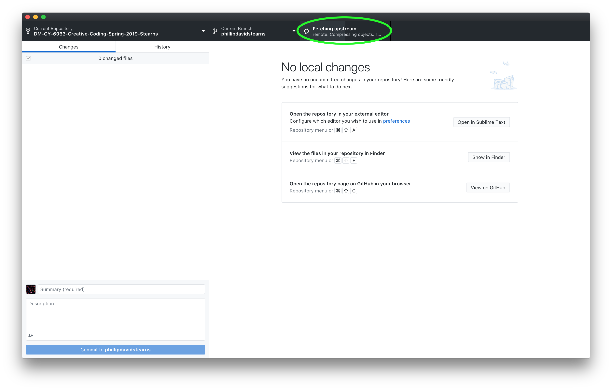
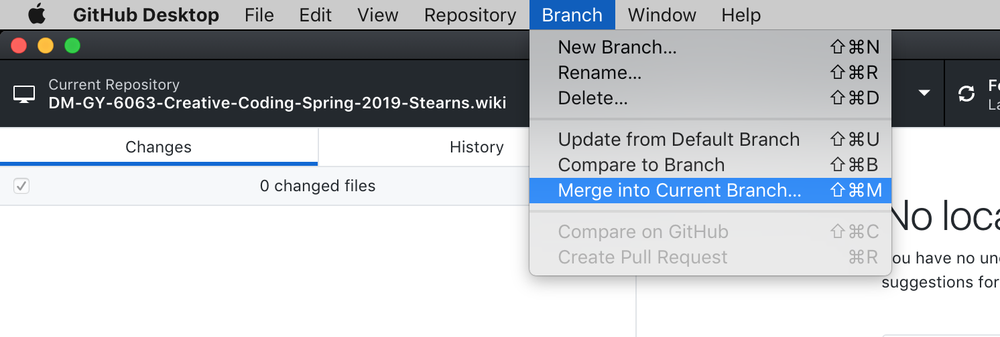
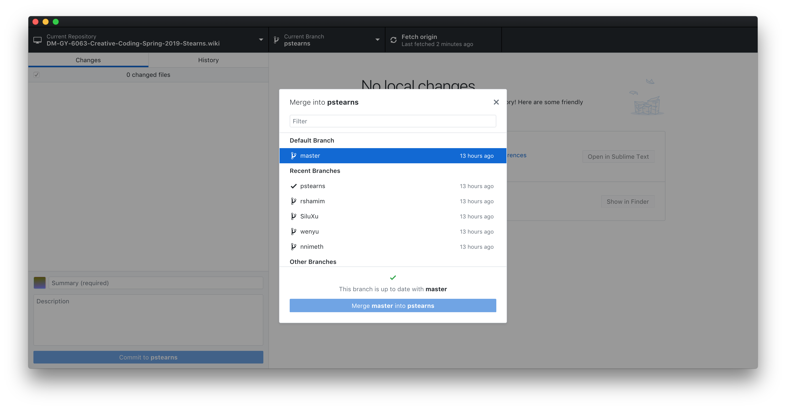
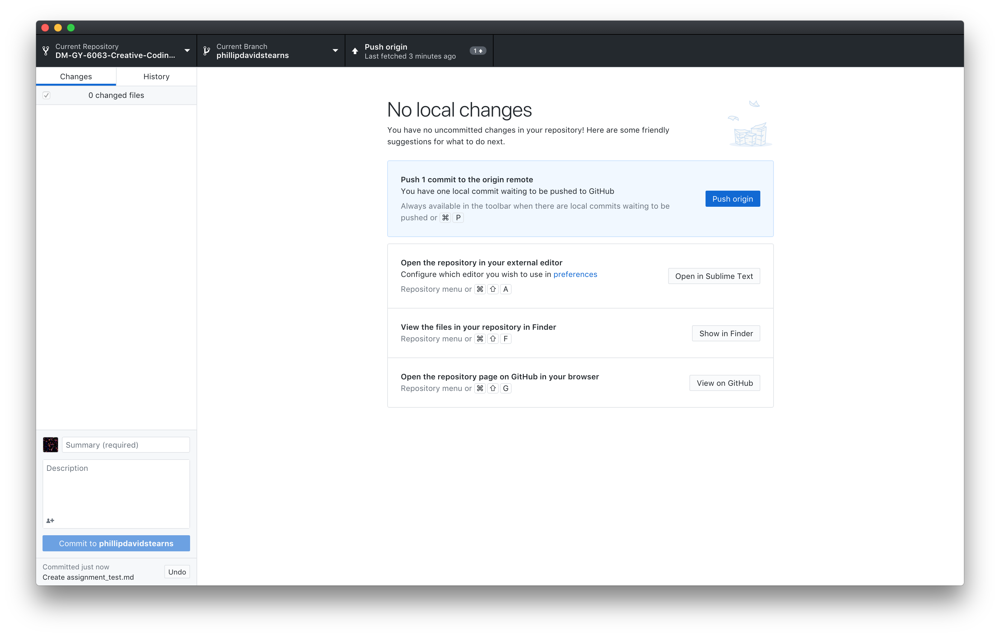

# Updating Your Branch of the Class Wiki

Occasionally, you may want to update your branch of the class Wiki with the latest changes. It's not as crucial as updating your branch of the class repository, but it's highly recommended as good practice.

It's fairly simple.

## Step 1: Fetch Origin (`command+shift+p`)

## Step 2: Branch > Merge into Current Branch (`command+shift+m`)

## Step 3: Select Master + Click Merge

## Step 4: Push Origin (`command+p`)

-

# THAT'S IT!

Your wiki folder should be up to date with all the freshest freshness.