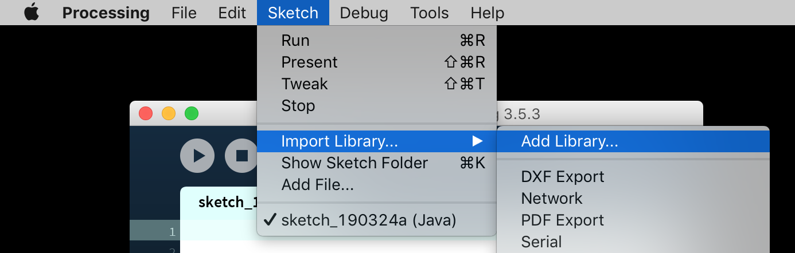
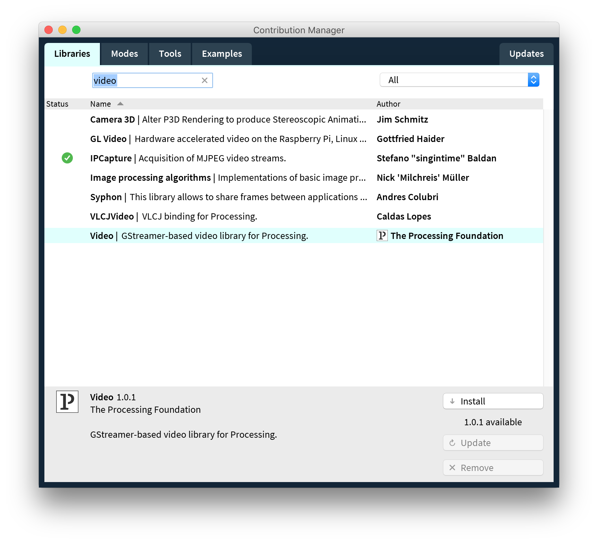
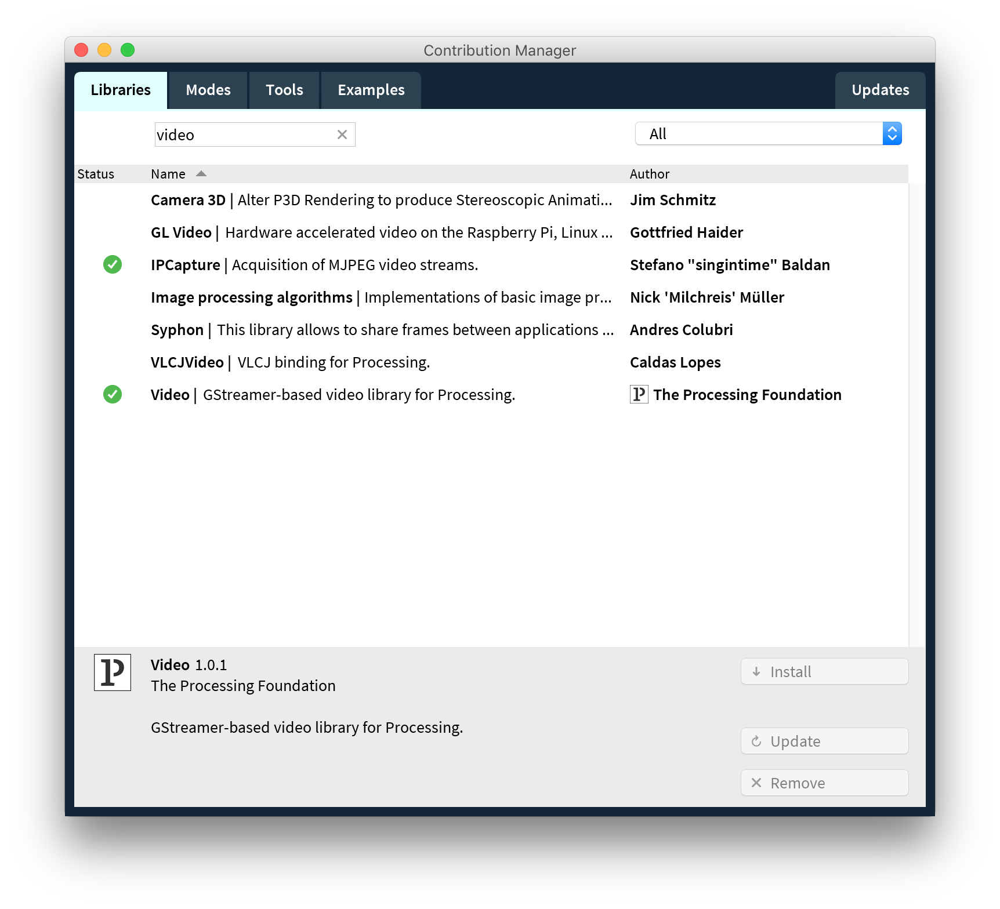
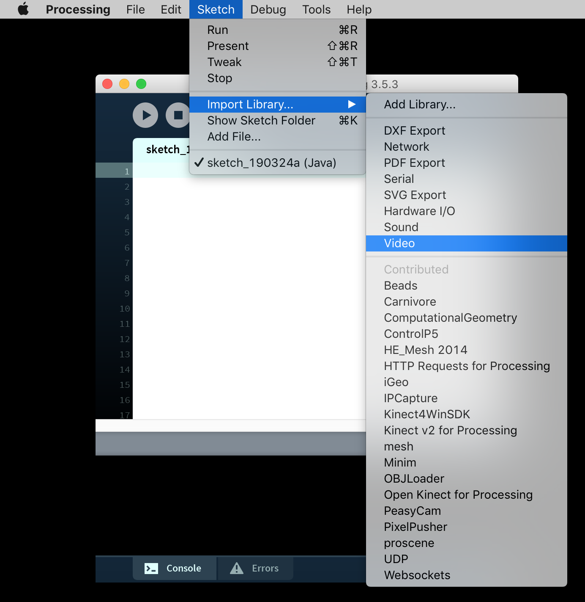
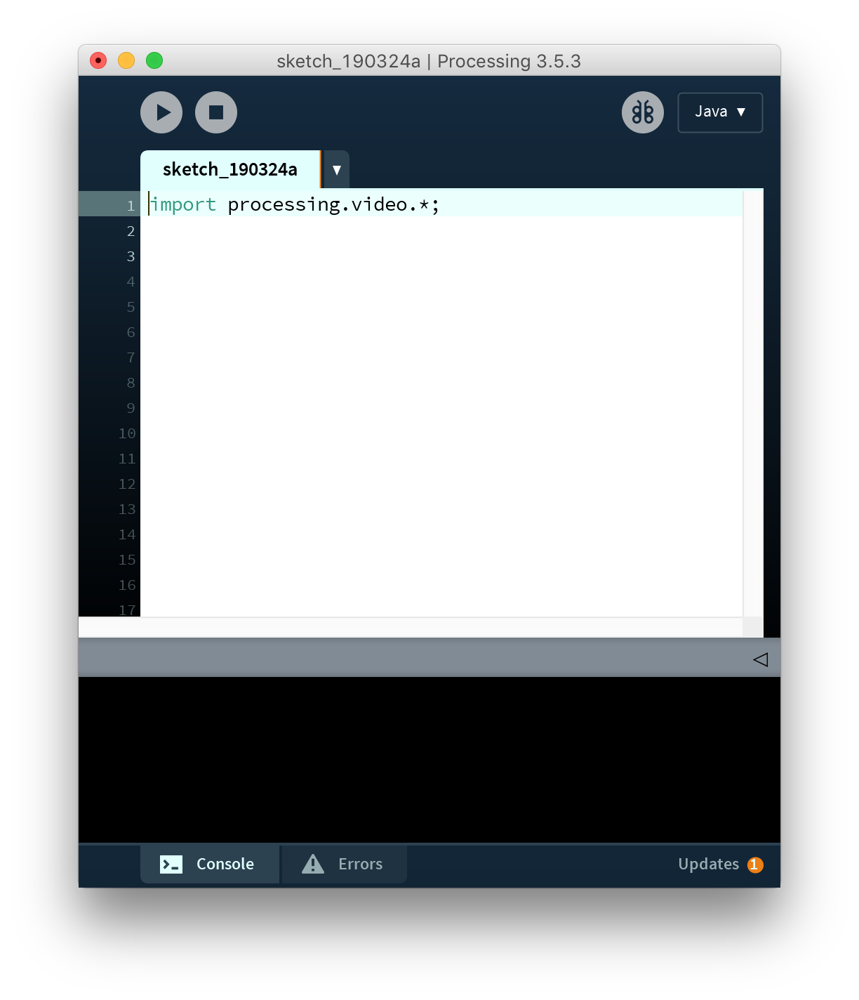
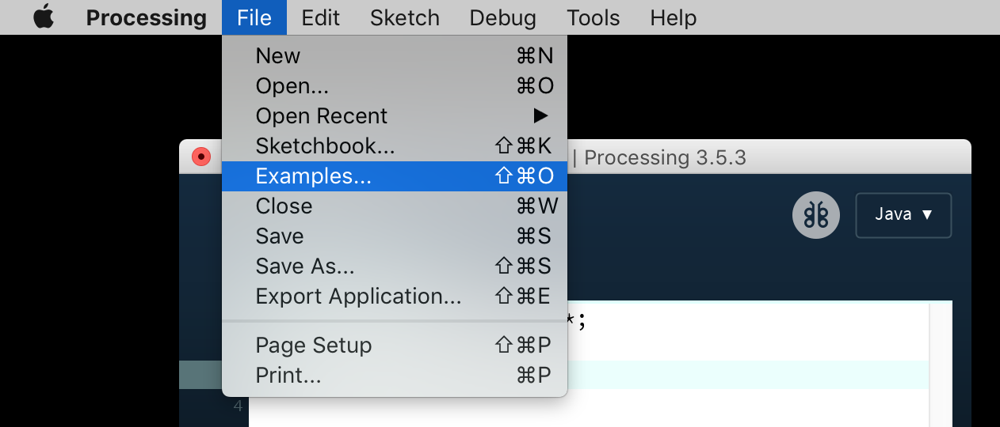
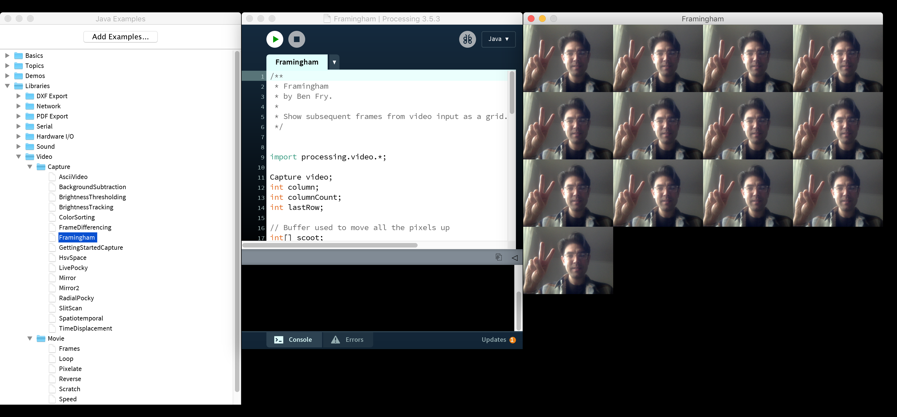

# Working With Libraries

Processing is a core library of functions that make it easy for non-technical people to get started with using code to create graphics. Processing is built with Java and extends Java's functionality. Processing's core can be further extended using libraries. These libraries are collections of functions that aim to make other features and tasks accessible to users of Processing.

Networking, sound, video, 3D mesh generation. These things are possible with Processing, but not built into the core code base. Authors have written libraries the extend Processing's functionality allowing you to easily access these extended features. There are libraries for sound, reading input from the Kinect, taking input from game controllers, passing video streams into and out of Processing to other video applications, listening to network traffic, drawing oscilloscopes!

Here's a quick guide to setting up a library and learning how it works.

## 1: Choose and Add a Library

Say you want to work with video, either from your built in web cam or from a video file. Processing doesn't have a built in collection of functions for video, so we have to download a library that add this functionality. Click `Sketch > Import Library... > Add Library...`

## 2: Search, Select, Install

Enter a keyword into the search bar, something that describes what you are looking for. Searching for `video` brings up a few libraries. You can see that I've already installed IPCapture. If you want to know more about a library, search for it online! For now select **Video** and click install.

## 3: Installed!

When the library finishes installing, a while check should appear in a green circle next to it.

## 4: Import into your Sketch

Libraries don't just automatically grant you access to their features once they're downloaded. You need to import them into your project. This creates a reference between your Sketch and the code contained within the library. Click `Sketch > Import Library > Video`. Notice that there are loads of other libraries in that pulldown menu. I encourage you to explore any that sound enticing.

## 5: Imported

Sometimes libraries have many different components to them. The Video library only has one. The `import` code appears as a single line and represents the link between your sketch and the code in the library. You can now start coding with the Video libraries functions and classes.

## 6: What does this button do?

Don't know what a library is good for or whether it can do what you want? First step is to try to find the library's website online (there typically is a project website for each library). Second is to browse through the examples provided to Processing. Find them by clicking `File > Examples`.

## 7: Explore!

Examples give us a quick look at how a particular part of the library works. Frequently, libraries will have their own classes and functions. By tinkering with the examples, copying and pasting and modifying them in our own sketches, we can get a sense of how they work and how to use them. If the examples aren't enough, look for the documentation online!

