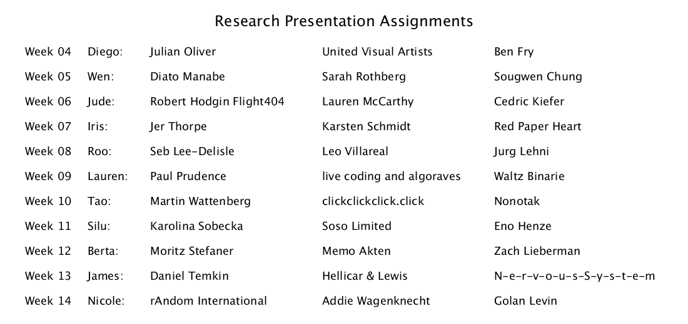

## Research Presentation

When working for a client or for yourself as part of your independent creative practice, research will play an important role in any project from the very beginning. Whether developing an idea or pitching a developed project, you'll need to have a grasp on how your work relates to the broader field and how to communicate your ideas to others by giving context through citing similar work.

You will be assigned two subjects: a group, project, artist, or designer. Prepare a presentation to deliver to your classmates. Time your presentation to be 10-15 minutes long. Include *3-4 visual examples of each subject work* and address the following: 

* General overview of your subject.
* What is original/unique about how this artist uses technology? 
* What kind of code did the artist use? (JavaScript? Flash? Procesing? openFrameworks? VVVV? Python?) How are they using the code? What is the code achieving?
* Why is it necessary that the artist use code? (ie: particularly if it’s non-interactive, could it have been achieved with traditional or linear media?)
* Your presentation must be prepared and professional.
* Other than the artist's/designer's/firm's names, DO NOT USE TEXT ON YOUR SLIDES. 

### Tips for your presentation

* Look at your audience, your classmates. You are presenting to them, not your professor!
* [THOUGHTS ON PUBLIC SPEAKING BY ZACH HOLMAN](http://speaking.io/) Click the links!!!
* Create a 5-7 minutes presentation (pdf, powerpoint, keynote, quicktime, etc.)
* Decide ahead of time whether to mirror your display or not.
* Plan ahead! Make sure you have the right hardware to connect.
* If you have sound during your presentation, see how to connect before class.
* PRACTICE PRACTICE PRACTICE

#### Show and Tell People

This was generated using the sketch at [presentationAssignments/presentationAssignments.pde](presentationAssignments/presentationAssignments.pde).

Pick two of the three subjects assigned to you. Your presentation should give each equal time. Share images, examples of the work, and anything else that relates to the subjects.

<!--
Week|	Subject						|	Presenter
---	|---								|---
3	|	Casey Reas, Ben Fry			|
3	|	Amit Pitaru, Waltz Binarie	|
4	|	United Visual Artists, Hellicar & Lewis, Seb Lee-Delisle|
4	|	Moritz Stefaner, Martin Wattenberg|
5	|	Kyle McDonald, Julian Oliver	|
5	|	Jer Thorpe, Soso Limited	|
6	|	N-e-r-v-o-u-s-S-y-s-t-e-m, [Field](https://www.field.io/) |
6	|	Marius Watz & Memo Akten |
7	|	Diato Manabe, Josh Nimoy  |
7	|	Leo Villareal, Cedric Kiefer |
8	|	Eno Henze, Dedric Kiefer |
9	|	Jurg Lehni, Red Paper Heart, rAndom International  |
10	|	Zachary Lieberman, Golan Levin |
11	|	Karolina Sobecka, Future Cities Lab |
12	|	Robert Hodgin Flight404, Karsten Schmidt |
13	|	Lauren McCarthy, Lia |
13	|	Ryan Habbyshaw, Michael Hansmeyer  |
13	|	Paul Prudence, [Santiago Ortiz](https://moebio.com) |
-->