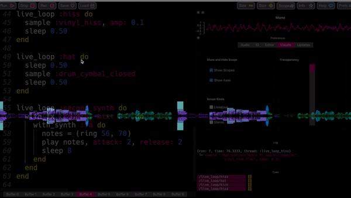

#  Feels
## A Creative Coding Final Project by Lauren Owen

This was a long time coming and we final reached the goal. I had to abandon previous formatting because it did not allow me to truly create something unique that I could take ownership of. 

Instead of using ports and osc to connect Processing to Sonic Pi, I used the regular audio input of my device to pick up sounds as a variable for the squares and ellipses to generate from. The entire experience is meant to be an interaction with live coded music and there is a sample avaailable if Sonic Pi is already installed on a tester's device. Nevertheless, a music playing or words spoken can be picked up as I ran many tests with spotify playing in the background.

### To use:

Open the processing file
Select Run
Change screens so you can open and play your music file
If using Sonic Pi, change preferences to transparent window with the processing window running directly under it and run code
To record audio, click 'R' on keyboard
To end recording, click 'R' on keyboard
To playback recordig, pause your music and click 'S' on processing run window
This will save it to craetions folder and play it back
To save screenshots of visualizer, click anywhere on the window

