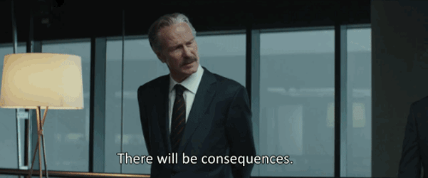

# WEEK 03

## Agenda

1. Updates to Journal 
2. Research Presentation Assignments
3. Questions and Challenges from Assignment 02a
4. Review Arrays, Conditionals, Loops
5. Creating Classes
6. Research Presentation - Jay
7. Assignment 02b

## Research Assignments

You can find the research assignments for the rest of the semester [here](https://github.com/pds-nyu-idm-cc/DM-GY-6063-Creative-Coding-Spring-2019-Stearns/blob/master/research_presentation.md).

Please pick two of the three subjects to present on. ~5 minutes each.

## Game Challenges

#### Observations:

* boolean
* states
* motion


## Arrays


Arrays store multiple values of a single type.

```
/*
We can declare an array of any data type
by adding the [] brackets.
*/


// declaring & filling the array manually
  String[] names = {
    "Fran", 
    "Sam", 
    "Dave", 
    "Jane", 
    "Eric", 
    "Lesley", 
    "Rachel", 
    "Jonas"
  };
  
// or if you don't know yet what your Strings will be,
// but you know how many you will have
// String[] names = new String[8];


void setup() {
  size(100, 100);
  noLoop();
}

void draw() {
  // to access the contents of an array
  // specify the index you want to retrieve
  println(names[0]);
  println(names[1]);
  println(names[2]);
  println(names[3]);
  println(names[4]);
  println(names[5]);
  println(names[6]);
  println(names[7]);
}

```


## Conditionals




### Boolean Logic:

A boolean expression is one that compares two values based upon a logical condition. The evaluation of an expression results in either a true or a false. Common conditionals are:

These evaluate to true for the case that:

* `==` EQUAL TO: if the value of A and the value of B are equal
* `!=` NOT EQUAL TO: opposite of `==`
* `&&` AND: if A is true AND B is true
* `||` OR: if A OR B is true
* `<` LESS THAN
* `<=` LESS THAN OR EQUAL TO
* `>` GREATER THAN
* `>=` GREATER THAN OR EQUAL TO

### `if` statements

Oftentimes we want parts of our code to execute based upon a condition. `if` statements are a simple way to do this.

`if	` takes a boolean expression as an argument and executes the code in `{}` or the single line immediately following it.

Statements like `else` are used to catch the cases where the expression provided `if` evaluates to false. `else if()` allows us to chain conditions for execution and perform different calculations based on the results.

Here it is in theory:

```
// a simple if statement:
if(someCondition) doThis();

// when executed code is more than one line
if(someCondition){
	doThis();
	doSomethingElse();
}

// simple if else
if(someCondition){
	doThis();
} else {
	doThat();
}

// simple example of else if
if(someCondition){
	doThis();
} else if (anotherCondition) {
	doThat();
} else {
	doWhatever();
}
```

## Loops


### `while` loops

Be careful with these. If your condition is never met, then the while loop never exits!

```
while(someCondition){
	doThis();
}
```

### `for` loops

For iterating through a number of things or doing something a fixed number of times, use the `for` loop. It's basic construction is:

```
for(int counter = 0; counter < number_of_iterations; counter++){
	doThis();
}
```
In this structure, we declare a counter or index, in this case `counter` and initialize it to `0`, though we could initialize it to any value we want. We then execute the code in a loop and increment the counter by 1 each time using `counter++`. We do this so long as the counter is less than `number_of_iterations`.

`for` loops are useful for interating through an array:

```
for(int i = 0; i < 100; i++){
	println(myListOfStrings[i]);
}
```

### `switch` structures

If you find yourself using complicated `if else` chains, maybe you should consider using a switch.

```
switch(key){

	case 'a':
		println("Holy smokes! You pressed: "+a);
		break;
	
	default:
		println("Sorry... I'm not into that key...");
		break;
		
}
```
## Functions


If we find that we are typing the same code over and over, of if the same block of code appears in multiple places, maybe it's time to **abstract** it into a function.

Functions and other abstractions are handy ways to simplify and organize code by functionality.

```
void setup() {
  size(100, 100);
  noLoop();
}

void draw() {

  // when I want to call my function, I do this:

  myFunction();
}

// we define a function and then call it
// a function is defined like so

void myFunction() {
  println("Yay! I made a function!");
}

// I generally define functions after the setup and draw functions


```

## Classes


Classes allow us to define our own objects and to simplify the management of complex.

Allow me to demonstrate.