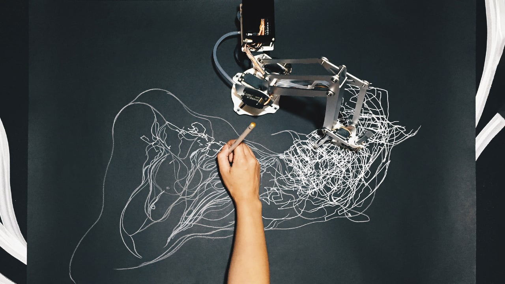
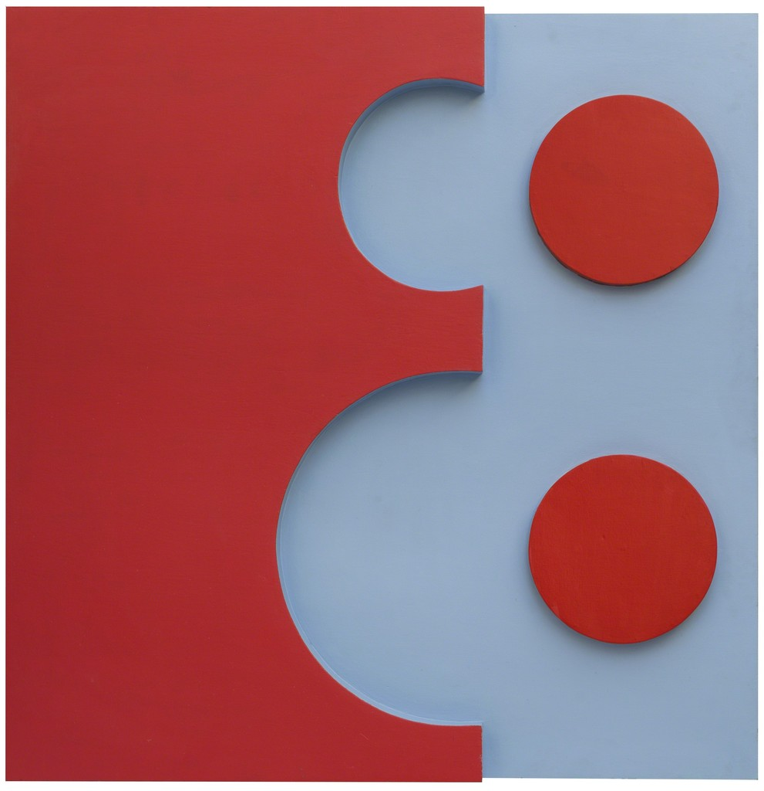
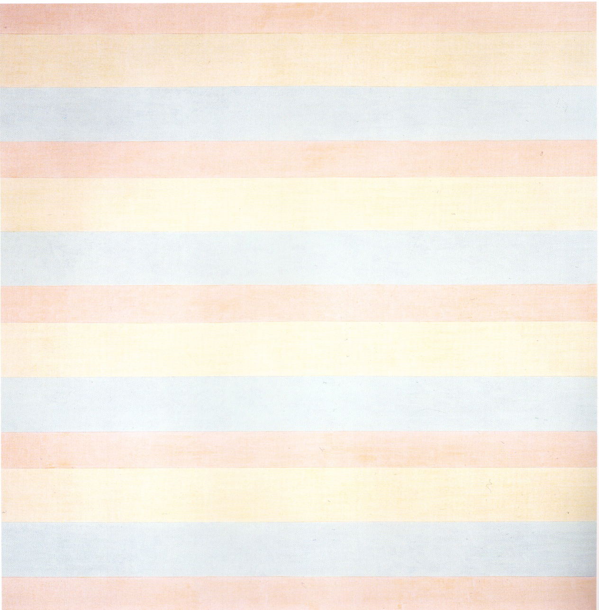
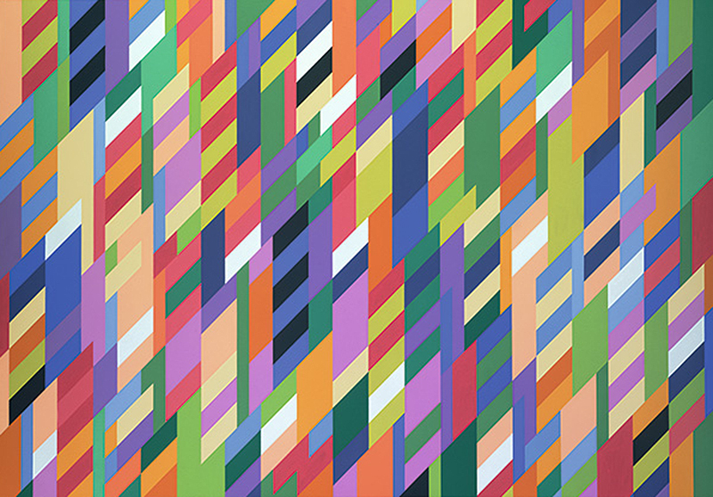
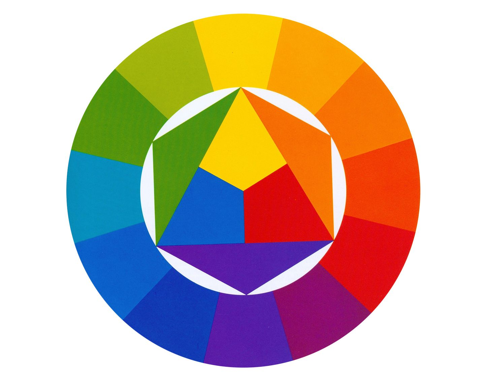
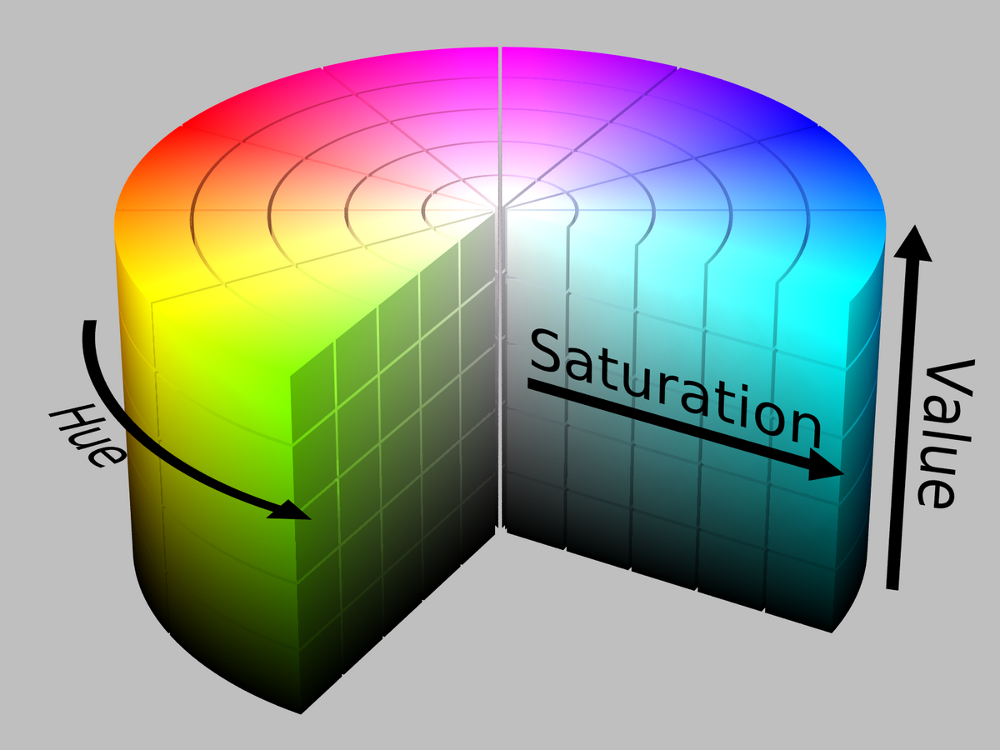
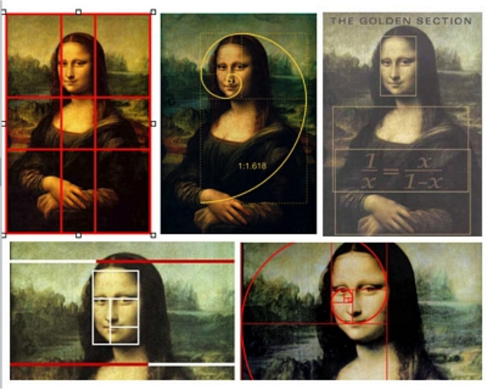
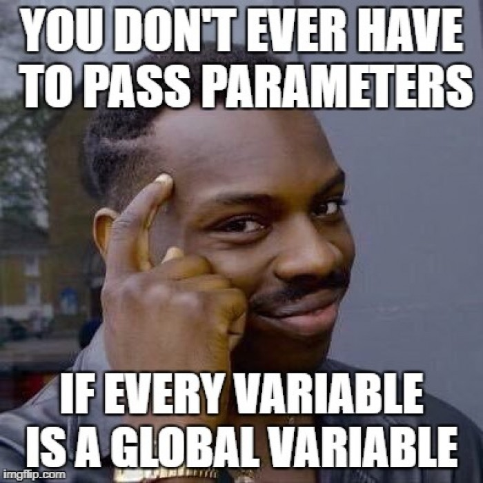

# WEEK 04

## Agenda

1. GitHub Check-in re: Journal Wiki
2. Code Review: Assignment 02 - Play Test our Games
3. Formal Elements in Art and Code
4. Coding Concepts: Abstraction
5. Research Presentation: 
6. Assignment 03

## Posting Journals to the Class Wiki

Rather than posting to individual repos, I asked the class to follow these steps:

[https://github.com/pds-nyu-idm-cc/DM-GY-6063-Creative-Coding-Spring-2019-Stearns/blob/master/wiki_help/wiki_help.md](https://github.com/pds-nyu-idm-cc/DM-GY-6063-Creative-Coding-Spring-2019-Stearns/blob/master/wiki_help/wiki_help.md)

The idea is that each student has their own `.md` file and will maintain their journal by adding to it just like the example I'm maintaining here:

[https://github.com/pds-nyu-idm-cc/DM-GY-6063-Creative-Coding-Spring-2019-Stearns/wiki/pstearns_journal](https://github.com/pds-nyu-idm-cc/DM-GY-6063-Creative-Coding-Spring-2019-Stearns/wiki/pstearns_journal)

We'll take 15 mins to make sure that everyone has followed the steps and that we're all able to push our journal updates to the class wiki.


## Code Review: Play Testing Assignment 02

We'll pair off and play test each other's games. Give a brief introduction of your game's concept to your partner, the controls, objectives. Take turns playing and reviewing the code. Ask each other questions and make sure you both understand each other's code and how they implemented different mechanics.

If your partner had an amazing game, share it with us! We'll looks at 3-5 in depth.

-

# Formal Elements in Art

A brief review of formal elements in art. Formal elements are elements that we used to evaluate and plan the visual properties of an artwork. Some of these elements will be familiar to use in the Processing environment and it's no accident. Processing was designed for artists to quickly translate their vocabulary into code.

## Line


Sougwen Chung

A mark created by the movement of a point, or `point()`.

In Processing: 

* `line()` - a straight line 
* `arc()`, `curve()`, `bezier()` - curvature

Lines can have many qualities:

* Show contour or outline
* Express feeling or emotion
* Convey movement or motion

In Processing we control the expressive and visual qualities of a line by specifying the `strokeWeight()` and `strokeColor()`.

Checkout `beginContour()` and `endContour` with `bezierVertex()` or `curveVertex()` to create complex contour lines.

## Shape


Noemi Escandell

A space enclosed by a line. It can be the outline alone, or a filled outline, or simply the filled shape.

In Processing:

* `ellipse()` - circular or elliptical shapes
* `square()`, `rect()`, `quad()` - square, rectilinear, quadrilateral, or quadrangle shapes
* `triangle()` - make a triangle
* PShape - datatype for custom shapes


## Form


Charlotte Posenenske

Refers to 3-dimensional shapes. Form refers to the general shape of a 3D object:

* Spherical, Spheroid
* Cuboid,
* Cylindrical
* Conical

## Tone


Agnes Martin

Is the quality of light or darkness. This can simulate or give the impression of light quality through shading. Pay attention to how 2D animations use shadow and highlight to convey form.

## Texture


Tauba Auerbach

The surface quality. This gives the impression of what something feels like. Since we're dealing with computer generated art, our texture is simulated. It's a visual texture.

In Processing we can use shapes and lines to create visual textures. We can also use images and different functions to control pixels individually.

Have a look at `loadPixels()` and `updatePixels()` along with the `pixels[]` array. We'll cover `PImages` in the next class.

## Repetition


Bridget Riley


Repetition can occur at different scales to achieve a range of effects. Repetition is something that's intuitive and readily accessible to the creative coder. For loops are the basis of repetition.

## Pattern


By repeating a texture, shapes, lines, or tones and colors, one can create a pattern. The underlying order or design that guides the quality of a pattern is called a motif. When we deal with motifs and patterns, understanding how to define classes and instantiate objects described by those classes becomes essential.

## Color



There are a couple of different ways to approach color in Processing: Red, Green Blue (RGB) and Hue, Saturation, Value (HSV): 

### RGB - Red Green Blue


Screen colors are additively mixed. When combined, they for white. This is opposed to pigments which are subtractive, all colors mix to black.

In Processing we use the color datatype to deal with colors. It's a 32bit value that holds Alpha (transparency), Red, Green, and Blue as 8bit values.

We are familiar, perhaps with RGB represented as 0-255 values. Let's look a a simple red hue as represented in RGB:

	Red: 240
	Green: 0
	Blue: 0

We might specify this in Processing like so:

	color red = color (240, 0 , 0);

Inside out color variable we'd have a binary number that looked like:

``` 
decimal 240 is 11110000 in binary

11111111 11110000 00000000 00000000
-------^ -------^ -------^ -------^
Alpha    Red      Green    Blue

```

We might represent this beastly number in hex or 0x:

```
0xFFF00000
```

If we use this notation, we always have to specify the alpha value.

Otherwise, if it's always opaque, we can use:

```
color red = #F00000;

```

### HSV - Hue Saturation Value



This is a way of specifying color and brightness or value in a way that is similar to thinking about polar coordinates as opposed to cartesian.

The hue is the angle around the color wheel, and the radius is the brightness or value. The saturation is a 3rd dimension or attribute that allows us to specify the intensity of the color.

see `colorMode()` for ways of working with HSV.


### Alpha

Alpha is a 4th dimension or parameter that allows us to specify the transparency of something. See the `color()` reference page on Procesing.org for specifying alpha values.

## Color Scheme


Rachel Lachowicz

The general nature of the colors used.

* Monochromatic - Single hue of varying value and saturation
* Analogous - a range of hues that are similar or related by proximity on the color wheel.
* Complementary - Opposites on the color wheel

## Composition



The spatial arrangement of elements on a canvas that create or challenge a sense of balance. Composition to a large part is related to the way the eye moves through a work. How the eye is guided by line or changes in texture or color or tone.

The simplest approach to formal analysis of composition is to identify where the focal point of a piece is, and not where the eye moves from there. Generally, works can be analyzed based on how the picture plane is divided.

-

# Coding Concepts: Abstraction

Abstraction is a concept in coding that allows for us to access the functionality of several lines of code with a simpler representation.

A variable on its own is already an abstraction for some collection of zeros and ones stored at an address in the memory of your machine.

An **Array** allows us to abstract multiple values of a single type into a single object.

**Functions** allow us to represent several lines of code that allow us to perform some task in a single line of code.

**Classes** allow us to describe objects with common attributes and behaviors.

Abstraction allows us to deal with complexity by simplifying the code that we need to write and interact with.

## Arrays (review)

* Arrays allow us to store a group of related pieces of data in one structure.
* Array elements hold the data of a type we specify when we declare our array.
* Arrays must be initialized and must be given a fixed length.

### Accessing Array Elements

* Arrays have a define length:

```
int[] values = new int[12]
```

* The code above initializes an array of integers with a length of 12.
* Arrays are accessed by specifying the index between `[]`

```
values[2] = values[0] + values[1];
```

* The above code adds the values of two array elements and stores them in a third.
* Elements are numbered starting at 0 up the length of the array - 1
* We can add the elements in an array using a for loop and calculate the average

```
int sum=0;
float avg=0.0;

int[] values = {12, 4, 82, 3, 61, 42, 2, 91, 6, 5};

for(int i = 0 ; i < values.length; i++){
	sum+=values[i];
}

avg = sum / values.length;

println("Sum: "+sum);
println("Average: "+avg);

```

## Functions



If we have a block of code that we use again and again, it doesn't make sense to copy and paste it for every time we need to use it. Rather, we should create a function that performs the same task of that block of code and refer to the function whenever we need that task performed.

#### A function has 4 main parts:

1. returned data type:
	* void
	* int
	* float
	* String
	* boolean
	* an object of a class
	* an array of any of these
	* ...
2. a name
3. parameters or arguments
4. code to execute 	

#### We've Already Use Functions.

```
void setup(){
	size(500, 500);
	background(255);
}
``` 

* `void` is the data type returned, in this case `void` means nothing is returned
* the name of the function is "setup"
* the parentheses are empty, but this is where any arguments or parameters would be passed to the code within the `{}`
* between the `{}` is the code that is executed

#### Let's Create Our Own

How about a function that returns a boolean and compares two floats and is named isGreaterThan:

```
boolean isGreaterThan(float _a, float _b){
	return _a > _b;
}

```

Note that we use `_a` and `_b` instead of `a` and `b` as our variable names. The reason is that it makes it easier to tell which variables we are using within the scope of the function.

This isn't the most practical example, but illustrates the point: you can create a function that does incredibly useful things, or you can reinvent the wheel.

Generally, you want to keep functions brief, flexible, and modular.

## Classes

### The Problem

You've probably noticed when dealing with multiple game objects, your code complexity can get out of hand easily if you try to deal with much more than 5 objects if you're not using arrays.

```
float ball1_x;
float ball1_y;
float ball1_sx;
float ball1_sy;
float ball1_size;
color ball1_color;

float ball2_x;
float ball2_y;
float ball2_sx;
float ball2_sy;
float ball2_size;
color ball2_color;

float ball3_x;
float ball3_y;
float ball3_sx;
float ball3_sy;
float ball3_size;
color ball3_color;

float ball4_x;
float ball4_y;
float ball4_sx;
float ball4_sy;
float ball4_size;
color ball4_color;

float ball5_x;
float ball5_y;
float ball5_sx;
float ball5_sy;
float ball5_size;
color ball5_color;

```

As soon as you start using arrays, you can easily manage an arbitrary amount of game objects.

```
float[] ball_x;
float[] ball_y;
float[] ball_sx;
float[] ball_sy;
float[] ball_size;
color[] ball_color;
```

But as soon as you start building functions for different behaviors like updating, finding the distance between two balls, drawing, tracking whether the game piece is in play, or if you have a lot of different properties you need to track, you need another solution.

Enter classes.

### The Solution

In **Object Oriented Programming** (OOP) languages, classes describe a class of related objects. Objects can be anything. A dog, a person, a car, a carrot, a game piece, a fish, etc...

* Objects have properties and behaviors.
* Within a class, objects share the same kinds of properties and behaviors but might vary in the quantities or values of each.
* Different classes may differ in properties and behaviors.

In OOP languages, _**properties**_ are called _**fields**_, and _**behaviors**_ are called _**methods**_

#### Definition

We define our class in a way that looks similar to defining a function, but just a little different:

```
class Ball{
}
```

#### Quick Note on Naming Conventions:

* variable names follow this general pattern:
	* Cannot begin with a number!
	* Starts with a lowercase letter, e.g. `variable`
	* If contains more than one word, the subsequent letters are capitalized, e.g. `someVariable`.
	* If contains more than one word, words can be separated with `_`, e.g. `some_variable`.
	* If contains a capitalized abbreviation or acronym, maintain the capitalization, e.g. `colorRGB`.
* function and method names follow a similar pattern to variable names
* class names begin with a capital letter, e.g. `GameObject`.

#### Fields

Properties! Fields are the variables that represent properties of our objects.

```
class Ball{

	// fields
	
	float x;
	float y;
	float sx;
	float sy;
	float size;
	color c;

}
```

#### Constructors

When we declare a variable and initialize it, some code runs in the background to reserve a place in memory and to fill it with a value. Constructors allow us to declare an instance of our object and to specify how it is initialized.

```
class Ball{

	// fields
	
	float x;
	float y;
	float sx;
	float sy;
	float size;
	color c;
	
	// constructor
	
	Ball(){
		x=random(width);
		y=random(height);
		sx=random(-2.5,2.5);
		sy=random(-2.5,2.5);
		size=random(5,50);
		c=color(random(256),random(256),random(256));
	}
	
	// you can define multiple constructors!!!
	Ball(float _x, float _y){
		x=_x;
		y=_y;
		sx=random(-2.5,2.5);
		sy=random(-2.5,2.5);
		size=random(5,50);
		c=color(random(256),random(256),random(256));
	}
	
	Ball(float _x, float _y, float _sx, float _sy){
		x=_x;
		y=_y;
		sx=_sx;
		sy=_sy;
		size=random(5,50);
		c=color(random(256),random(256),random(256));
	}

}
```


#### Methods

Rather than keeping the update, render, wrapping, or collision functions hanging out with the more structural functions of Processing, we encapsulate them within our class. These functions become our class's behaviors or methods:

```
class Ball{

	// fields
	
	float x;
	float y;
	float sx;
	float sy;
	float size;
	color c;
	
	// constructor
	
	Ball(){
		x=random(width);
		y=random(height);
		sx=random(-2.5,2.5);
		sy=random(-2.5,2.5);
		size=random(5,50);
		c=color(random(256),random(256),random(256));
	}
	
	// you can define multiple constructors!!!
	Ball(float _x, float _y){
		x=_x;
		y=_y;
		sx=random(-2.5,2.5);
		sy=random(-2.5,2.5);
		size=random(5,50);
		c=color(random(256),random(256),random(256));
	}
	
	Ball(float _x, float _y, float _sx, float _sy){
		x=_x;
		y=_y;
		sx=_sx;
		sy=_sy;
		size=random(5,50);
		c=color(random(256),random(256),random(256));
	}
	
	// methods
	
	void move(){
		x+=sx;
		y+=sy;
	}
	
	void warp(){
		x=(x+width)%width;
		y=(y+height)%height;
	}
	
	boolean hasCollided(Ball _b){
		return dist(x, y, _b.x, _b.y) < size;
	}

}
```

**Pow! We've made a class!**


## Challenge: Convert your Games to...

1. If you're not using arrays, create a version that uses them
2. If your'e not using classes, create a version that uses them
3. If you're not using ArrayLists, create a version that uses them
4. If you're using ArrayLists, create a version that uses inheritance
5. If you're using inheritance, prepare a 5 minute presentation on drawing machines to present before the end of class.

-
# Assignment 03: Drawing Machine

This assignment is meant to challenge your application of your new found coding skills to explore the formal elements of art.

1. Find a work of art that was made between 1900 and 1975 that doesn't use computational technologies
2. Perform a formal analysis of the work. Basically, describe it in terms of the formal elements of art: its use of line, shape, tone, color, rhythm, texture, etc.
3. Based on this formal analysis, approximately reproduce the work in Processing.
4. Create a machine that automatically produces works in the style of the piece you performed your analysis on.
5. digital color meter
