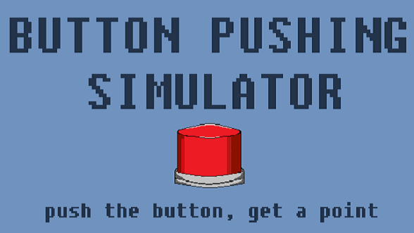
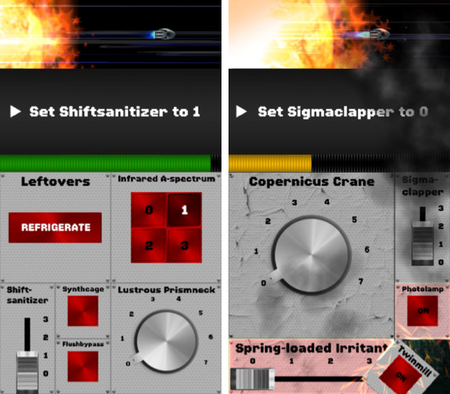
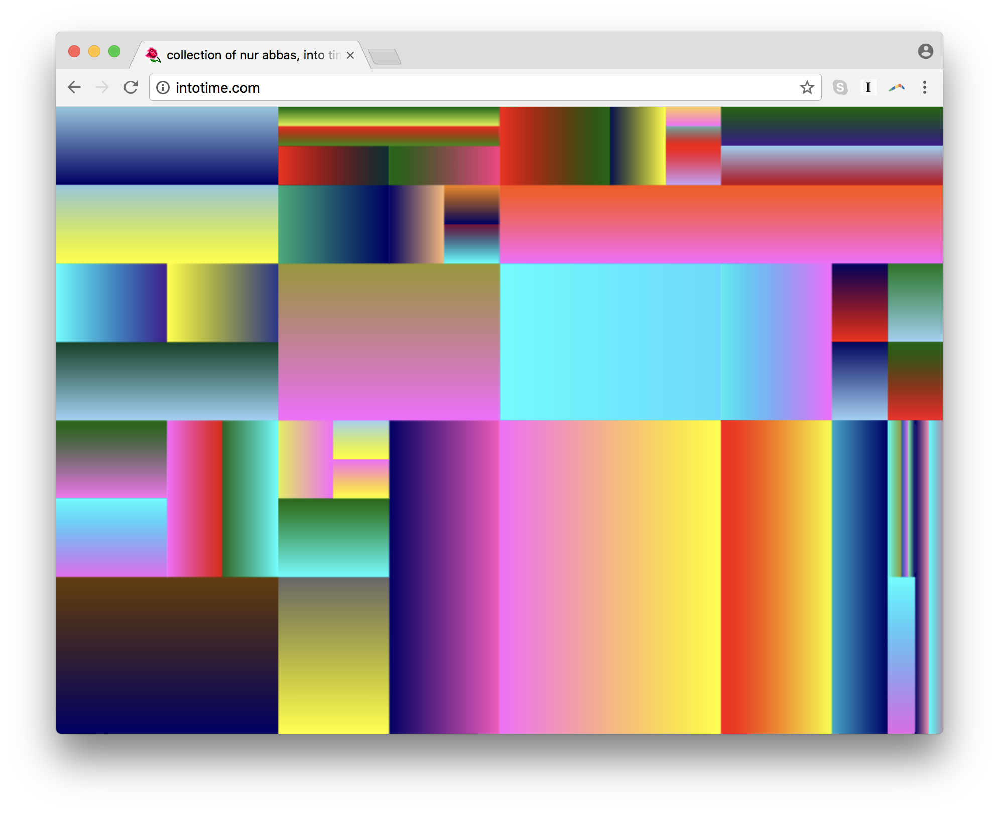

# Week 05 Homework:

## Class Review:

Some of the topics and functions we covered at the beginning of class:

* Creating a grid of objects using nested for loops
* `saveFrame()` to save a snapshot of the canvas
* using `pushMatrix()` and `popMatrix()` to translate and rotate shapes
* Radians

Challenges:

1. Buttons - basic interactivity
2. Collisions - boundary detection and reaction
3. Interactivity - tracking, following, avoiding
4. Randomness - using random() and noise()

## Research Presentations

Have a look [here](https://github.com/pds-nyu-idm-cc/DM-GY-6063-Creative-Coding-Spring-2019-Stearns/blob/master/research_presentation.md) for who's up next!

## Your Assignments

### Readings/Watching

There should be a lot of overlap, so pick whichever method works best for you. Don't do everything, just review, tinker with, and absorb the material.

* Read: Learning Processing - Ch. 8 & 9
* Read: [Getting Started in P5.js](https://p5js.org/get-started/)
* Read: [Processing transition tutorial](https://github.com/processing/p5.js/wiki/Transitioning-from-Processing)
* Read: Nature of Code introduction
* Watch: [Foundations of Programming in JavaScript 1.1-2.2](https://www.youtube.com/playlist?list=PLRqwX-V7Uu6Zy51Q-x9tMWIv9cueOFTFA)
* Watch: [Javascript Objects, Map and random- 2.3-2.5](https://www.youtube.com/playlist?list=PLRqwX-V7Uu6Zy51Q-x9tMWIv9cueOFTFA)
* Assignment 04

### Journal Entries (2)

If you need inspiration, dig into the [Class Resources](https://github.com/pds-nyu-idm-cc/DM-GY-6063-Creative-Coding-Spring-2019-Stearns/blob/master/resources.md) page.

I want to see posts that took thought, show reflection. At minimum, you should be asking and/or answering three questions about something you saw, something you're working on, a challenge you're facing (code related), or a challenge you overcame (again, code related).

There's a new method of keeping our journal! See [this guide](https://github.com/pds-nyu-idm-cc/DM-GY-6063-Creative-Coding-Spring-2019-Stearns/blob/master/wiki_help/wiki_help.md) for how to clone and post your journal entries to the class wiki.

### Coding Assignment 4

## Impossible UI: A Game && || Artwork

* Envision a future device that can do anything you want. What does it do?
* Imagine the different functions and features and build the User Interface (UI) for it using out new found button building skills.
* We know how to move things around and make things happen when things are clicked, let's put them to use!
* When buttons are clicked, make the UI responsive. Does text appear? Does the screen change? Color and shape of the buttons?

### Gamify: Can you turn this UI into a game? 

Think Less:

More:

 [Spaceteam](https://spaceteam.ca/)

## Artify: Poetry or Painterly

Something like:
 
[Rafael Rozendaal](https://rhizome.org/editorial/2017/dec/08/rozendaal-the-path-to-abstraction/) 
hint: you can view the .js files!

