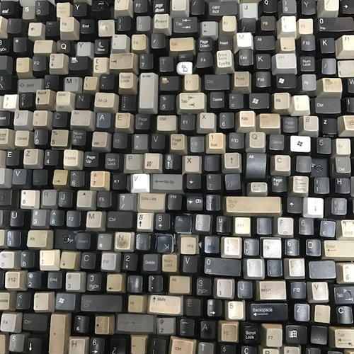
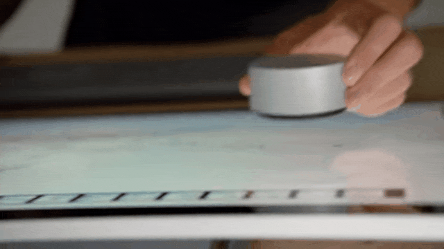
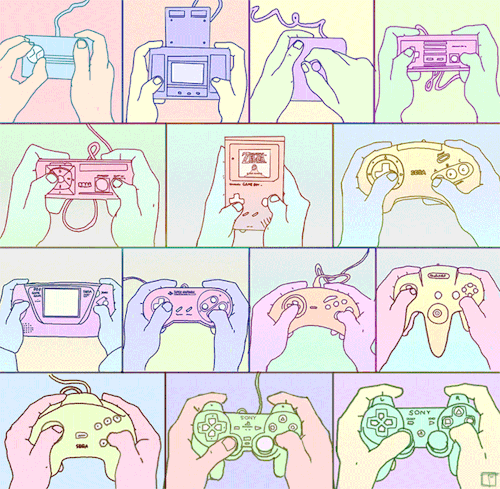

# WEEK 05

## Agenda

1. Code Review: Assignment 03
2. Coding Challenges
4. Research Presentation: 
5. Assignment 04: Gamify/Artify UI

-

# Challenges

We've covered a lot of ground. Perhaps too much. Let's take a day to review what we've learned and apply it to some common situations.

## Challenge 01: Buttons

Though there are GUI libraries like controlP5, learning how to make your own buttons can help you learn a lot about how to check for boundary, overlap, and intersect conditions. Being able to think through these conditions are key to coding interaction and simulating physics

1. Make a circle detects when you move your mouse over it by changing to a "highlight" color.
2. Add a feature that will detect when the mouse button is pressed when the cursor is over it by changing to a "pressed" color.
3. Add a feature that will toggle between pressed and inactive states. There should be three colors in play: inactive, pressed, and active.
4. Do this for a rectangular button

## Challenge 02: Collisions

Detecting when an object encounters a boundary is one thing, detecting when two objects collide requires a an algorithm that checks for a simple overlap event. This extends the button challenge and applies it to a situation you'd find in games.

1. Create two balls and make the move around on the screen.
2. Add functionality that will keep the balls on the screen, simulating a simple collision with a wall.
3. Do not let the edge of the balls leave the screen.
4. Detect whether the balls overlap and change their direction to simulate a collision.

## Challenge 03: Interaction

1. Make a shape track your mouse position.
2. Make a shape ease to your mouse position.
3. Make a shape avoid your mouse.

## Challenge 04: Randomization

1. Create a handful of buttons.
2. Make each button randomize a different attribute of any of the other buttons or the background (size, shape, rotation, position).
3. Make each button randomize a different button attribute each time it's pressed (hint use classes)

# Assignment 04

## Gamify/Artify

1. Make an imaginary interface for a fantastic future technology that will have all of the buttons because it will do all of the things! Or at least imagine an interface that you might make or want to use.
2. Make all of the buttons! Use text and styles.
3. Take inspiration from the challenges above and make an interface that changes through pages or randomizes elements.
4. Now make a choice: Game or Art
	1. If Game, create a point system or incentivize interactivity through some other mechanism
	2. If Art, you can be poetic or you can be painterly. Or Both.
5. For the very brave, try to make a game that produces art.
6. This is all with "buttons"
