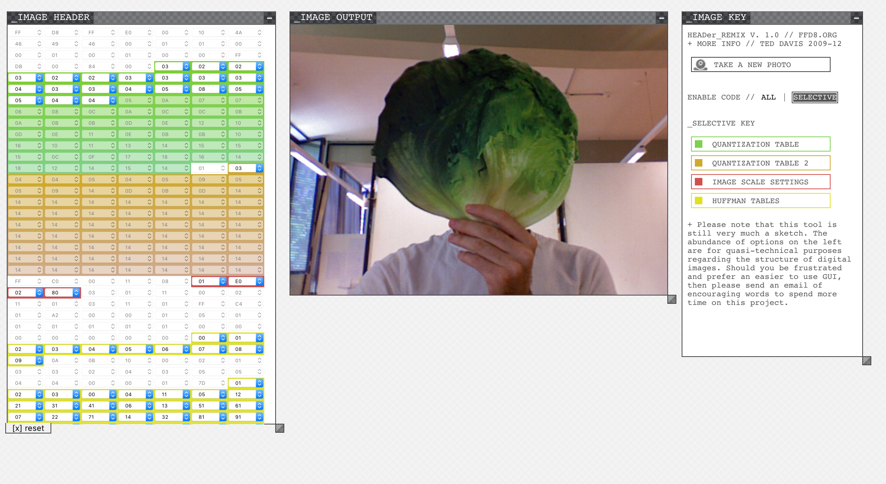

# Week 06

## Agenda

* Review Projects
* P5.js
* In Class Challenge
* Research Presentation
* Group Ideation Session: Mid Term Project
* Anatomy of a class

## Project Review

### Impossible UI

You were given an open ended assignment to extend the exercises from the in-class challenges to either a game or artwork (or art game) format. The prompts were:

* Envision a future device that can do anything you want. What does it do?
* Imagine the different functions and features and build the User Interface (UI) for it using out new found button building skills.
* We know how to move things around and make things happen when things are clicked, let's put them to use!
* When buttons are clicked, make the UI responsive. Does text appear? Does the screen change? Color and shape of the buttons?

Inspirations posted [here](https://github.com/pds-nyu-idm-cc/DM-GY-6063-Creative-Coding-Spring-2019-Stearns/blob/master/wk05/HomeWork-WK05.md) included a game called Spaceteam and an artist Rafael Rozendaal.

Let's see what everyone came up with!

## P5.js

There was a lot of material to review for this, but I want to make sure we're clear on how to work with P5.js for our class.

### Working with P5.js locally

I'm going to presume that everyone spent some time on the site, starting with the [getting started guide](https://p5js.org/get-started/), on to downloading [P5.js complete locally](https://p5js.org/download/), and digging around in the [empty-example]() folder. Yes, I downloaded and included the [P5.js complete package in the class repo](https://github.com/pds-nyu-idm-cc/DM-GY-6063-Creative-Coding-Spring-2019-Stearns/tree/master/p5).

You basically have 3 components you will always need to account for:

1. An html file that loads all the scripts and runs the p5.js sketch in a web browser
2. The P5.js libraries, you just need to know where these are and how to tell your html files where to find them.
3. Your javascript files. `script.js` by default. This is the code for your sketch.

### Editing HTML and JavaScript

First thing we need is a decent text editor to edit our files. I recommend using [Sublime Text 3](https://www.sublimetext.com/3) for this class. For you 1337 web dev types, you can use whatever editor or IDE you wish.

This is the index.html file from the empty P5.js example:


It's simple enough. All of our script tags are within the head tag.

```
<!-- p5.js libraries -->
<script src="../p5.min.js"></script>
<script src="../addons/p5.dom.min.js"></script>
<script src="../addons/p5.sound.min.js"></script>

<!-- p5.js sketch code -->
<script src="sketch.js"></script>
```

P5.js is a javascript library. When we use functions from that library in our own scripts, we are making references to the functions that are inside the P5.js library.

We need to make sure these scripts are loaded. If the path to the scripts is incorrect, the scripts won't load. 

So which scripts do we use? How do we work on and submit our assignments?

### Web Editor

Starting with the web editor is a quick and intuitive way to start coding and testing things out in P5.js provided you have internet access. It also provides us with a good template for how to work with P5.js locally when we're offline.

**1.** Head on over to the [Web Editor](https://editor.p5js.org/) and sign up for an account using your nyu.edu email address.

**2.** Edit your first sketch:


<<<<<<< HEAD
Rosa Menkman published [A Vernacular of File Formats](https://www.dropbox.com/s/r2an9biuttqpx0c/hifi%20Rosa%20Menkman%20-%20A%20Vernacular%20of%20File%20Formats.pdf?dl=0) a PDF detailing her exploration of file formats undergoing various types of corruption.
=======
**3.** Save the sketch:
>>>>>>> parent of 545d39b... glitches


**4.** Download it:


You can feel free to download this to where you work on your Processing assignments or right into your `student_work` folder.

**5.** Unzip it and Have a look inside the folder:


**6.** Checkout the index.html file in Sublime Text 3


<<<<<<< HEAD
* []()

In addition to copying and pasting chunks of raw image data, it's possible to use the find and replace feature of many text editors to alter the image data byte by byte. This effect as a far more drastic impact as it's changing a large percentage of data.

### Anatomy of a JPG



If you wish to target specific parts of a JPG. Ted Davis created [Header Remix](http://www.ffd8.org/header_remix/) an interactive application that you can use to single out and alter bits one value at a time.
=======
This html file is a lot more stripped down and references only the .min.js p5.js library files.

**7.** Have a look at the script.js file in Sublime Text 3


Look familiar? This is the code we entered in the editor window.

### Working Locally

We can start a new sketch in the **WebEditor** and download it to use as our template for all future projects:


When starting from scratch, locally, we can duplicate this folder, change the name, and edit to our heart's content.

We then would work with a split screen setup: browser on one side of the screen, editor on the other:


Make changes to the code. Refresh your browser. If you need to see errors for debugging, your browsers developer tools will provide you with info similar to what the IDE and WebEditor but it might not be as precise and require advanced knowledge. Proceed with Caution.


### Submitting Homework

If you're working from the WebEditor:

1. Save and download your work locally
2. Unzip and change the folder name to match the assignment number
3. Drag and drop that folder into your `student_work` folder
4. Go to the desktop GitHub app and fetch, commit, push, create pull request.

If you're working locally, start from step 3 above.

## In-Class Challenge

Translate code from last week's challenges into P5.js
Hint: [Transition Notes](https://github.com/processing/p5.js/wiki/Transitioning-from-Processing)

1. Toggle Button
2. Moving Button that "collides" with walls.
3. Randomization, when button is toggled, randomly change something about the sketch.

## Research Presentation

Jude presents 2 from the following:

* Robert Hodgin Flight404
* Lauren McCarthy
* Cedric Keifer

## Group Ideation Session: Mid Term Project

1. Let's take a moment to think about what we want to do, what we want to make. Is there a problem, whether technical, aesthetic, personal, social that you would like to work on using what we've learned so far. It doesn't have to be big, and it doesn't have to stray far from the two themes we keep coming back to: Game or Art. Write down at least 3 things you want to do, make, create.

2. Of the three ideas, let's share the most important one with the group. Identify how you might approach representing, researching/exploring or solving the problem, ask others for suggestions, offer suggestions.

3. Based on this feedback, try to simplify your formulation of the problem. What elements will you need to bring in. What research do you need to do. What materials do you need to gather. What techniques do you need to learn?

4. Put together a 1-page write up describing your mid-term project based on the above.


## Review of Classes

In Java, as with other Object Oriented Programming languages, classes describe objects that share a common set of properties and behaviors.

* Properties are called **fields** and are *variables* that contain data specific to an object.
* Behaviors are called **methods** and are *functions* that perform tasks specific to an object.
* Objects are **defined**  or described by classes.
* Objects are **instantiated** similar to declaring a variable.
* Objects must be initialized using **constructors**, special functions that determine the initial value of fields.

```
// definition of a class

class Object{

	// fields
	float field;
	
	// constructor
	Object(){
		field = 0;
	}
	
	// methods
	void method(){
	}
	
}

// creating an instance of an object of class Object named object

Object object;

// initializing the instance of class Object named object

object = new Object();

// accessing fields

float someVar = object.field;
object.field = someVar;

// calling methods

object.method();
```

## Homework: Mid-Term Projects 

Submit your 1-page description of your project and begin work gathering materials, identifying examples from within Processing and online that might help you. When you discover something, when you have an idea, write a Journal Entry for it!

I'd like to see at least 3 Project related posts concerning the above, plus Processing or P5.js sketches that have outlines and comments indicating how you are planning your project.
>>>>>>> parent of 545d39b... glitches
