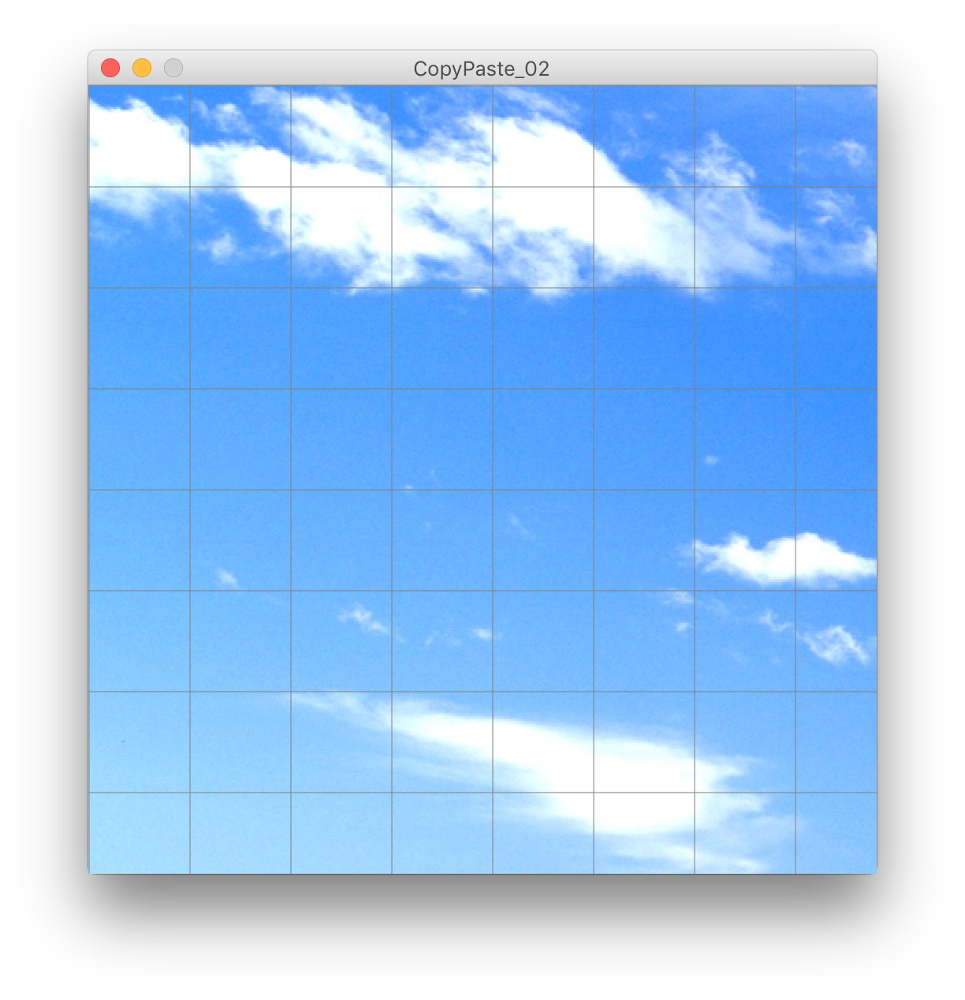

# Creative Coding II Day 2

In the last class, we got a taste of the basics of pixel sorting, pioneered by Kim Asendorf. Along the way, we explored a few different topics:

* ARGB color and Processing's color data type
* Processing's PImage class
* The anatomy of a class
* Resizing source images to fit/fill  the window
* Resizing the window to fit source images
* Iterating through images row by row and column by column
* The sort() array and reverse() array functions

Some things that we missed can be found hidden within some of my past projects in my [aYearInCode](https://github.com/phillipdavidstearns/aYearInCode) repository on GitHub. Sketches that deal with pixel sorting are:

* [LangstonSort](https://github.com/phillipdavidstearns/aYearInCode/tree/master/Processing%203/LangstonSort)
* [CellSort](https://github.com/phillipdavidstearns/aYearInCode/tree/master/Processing%203/CellSort)
* [moreSorts](https://github.com/phillipdavidstearns/aYearInCode/tree/master/Processing%203/moreSorts)
* [newSorts](https://github.com/phillipdavidstearns/aYearInCode/tree/master/Processing%203/newSorts)

Today we'll have a look at how the effect of datamoshing can be replicated in Processing by creatively copying and pasting pixels.

## Datamoshing

<br>
Takeshi Murata

### Datamoshing is the intentional corruption of MPEG-4 encoded video files.

Videos that are compressed using the MPEG-4 codec are most commonly used for datamoshing due to the way the codec processes the video stream. During MPEG encoding the video stream content for change. Changes are encoded in such a way that the compression artifacts are as imperceptible as possible. The result is a compressed video file that contains image frames that explicitly load an image onto the screen (i-frames), and frames containing data about what parts of the image changed, how, and by how much (p-frames).

Datamoshing typically involves the manual or automated removal of i-frames or copying and pasting of p-frames. Removing i-frames can cause changes made in subsequent frames to be mapped onto the imagery of preceding frames. It's most noticeable when the source material contains hard cuts between different scene or shots. Copying and pasting p-frames causes the melting blooms of color.

## History


I was unable to find where the term originated. I've attempted to find the earliest and most notable examples of datamoshing:

* Glitch Art discussion for 2006 [about glitching video](https://www.flickr.com/groups/52241691728@N01/discuss/72157594408091534/). 2007 posts by artist, sTalio mention MPEG codec corruption.
* 2007 - Artist Takeshi Murata creates a series of videos using the datamoshing technique.
* June 16, 2009 - Kanye West publishes the video for ["Welcome to Heartbreak"](https://www.youtube.com/watch?v=wMH0e8kIZtE) on YouTube.
* October 25, 2009 -  Chairlift publish their video for [Evident Utensil](https://www.youtube.com/watch?v=mvqakws0CeU) on YouTube. The artist who datamoshed Evident Utensil [posted a tutorial on YouTube](https://www.youtube.com/watch?v=tYytVzbPky8).

## Faking It


Without going too deep into how the codecs actually work, it's possible to simulate or fake the effect to some degree by creatively copying and pasting parts of an image back onto itself. Some things we'll need to cover along the way are:

* copying and pasting a region of an image
* classes
* PVectors
* Motion: accelerated with forces

## Copying and Pasting Regions

We'll start with some familiar [code]() to load an image into our sketch:

```
PImage img;

void setup(){
  size(500, 500);
  img = loadImage("images/windows_xp_bliss-wide.jpg");
  noLoop(); 
}

void draw(){ 
  image(img, 0, 0);
}
```

Next we need to:

* store the *location* of a region from which we want to copy, and to which we want to paste.
* define the *size* of that region
* write functions that extract and then insert pixels from our images based on the above.

```
PImage img;
float copy_x;
float copy_y;
float paste_x;
float paste_y;
int size = 64;

void setup() {
  size(500, 500);
  img = loadImage("images/windows_xp_bliss-wide.jpg");
  copy_x = 0;
  copy_y = 0;
  paste_x = width/2;
  paste_y = height/2;
}

void draw() {

  copy_x = mouseX;
  copy_y = mouseY;

  setImageRegion(paste_x, paste_y, getImageRegion(copy_x, copy_y, size, img), img);

  image(img, 0, 0);
}

// returns a region in an image
PImage getImageRegion(float _x, float _y, float _size, PImage _image) {
  return _image.get(int(_x), int(_y), int(_size), int(_size));
}

// writes pixels from one PImage into another
void setImageRegion(float _x, float _y, PImage _source, PImage _destination) {
  _destination.loadPixels();
  for (int y = 0; y < _source.height; y++ ) {
    for (int x = 0; x < _source.width; x++) {
      // translate to the coordinates in the _destination image
      int dest_x = int(_x)+x;
      int dest_y = int(_y)+y;
      // write pixels only to coordinates within the _destination image
      if (dest_x < _destination.width && dest_y < _destination.height) {
        _destination.pixels[dest_y*_destination.width+dest_x]=_source.pixels[y*_source.width+x];
      }
    }
  }
  _destination.updatePixels();
}
```

Awesome! We have one "tile", a region where we've copied pixels from one place, and pasted them into another. This is how it typically goes: you make incremental steps toward a complex goal, tackling the mechanics on a singular level and then scaling them up. Kind of like the relationship between high energy physics and astro physics.

## Making a Grid



Before we can do more complicated things with out copy/paste framework, we should have a look at how it scales across the image. The simplest way to do that is to copy and paste in a grid pattern. We'll add to our sketch code that calculates a grid and then iterates our process over it.

First step is to calculate the grid, and draw the results to check our work.

```
// these are global variables
int gridSizeX;
int gridSizeY;
int gridOffsetX;
int gridOffsetY;

// this goes in setup()
gridSizeX = int(width/float(size))+1;
gridSizeY = int(height/float(size))+1;
gridOffsetX = 0;
gridOffsetY = 0;

// this goes in draw()
drawGrid();

// this function is global
void drawGrid(){
  for(int x = 0 ; x < gridSizeX; x++){
    int lineX = (x)*size;
    stroke(127);
    strokeWeight(0.5);
    line(lineX,0,lineX,height);
  }
  for(int y = 0 ; y < gridSizeY; y++){
    int lineY = (y)*size;
    stroke(127);
    strokeWeight(0.5);
    line(0,lineY,width,lineY);
  }
}
```

## Copying and Pasting On the Grid


Next, we iterate over the grid. I've added some randomization to the copy coordinates to that we can see what the effects is on pasting into the fixed grid:

```
PImage img;

float copy_x;
float copy_y;
float paste_x;
float paste_y;
int size = 64;

int gridSizeX;
int gridSizeY;
int gridOffsetX;
int gridOffsetY;

void setup() {
  size(500, 500);
  img = loadImage("images/windows_xp_bliss-wide.jpg");
  copy_x = 0;
  copy_y = 0;
  paste_x = width/2;
  paste_y = height/2;

  gridSizeX = int(width/float(size))+1;
  gridSizeY = int(height/float(size))+1;
  gridOffsetX = 0;
  gridOffsetY = 0;
}

void draw() {


  for (int y = 0; y < gridSizeY; y++ ) {
    for (int x = 0; x < gridSizeX; x++) {
      
      copy_x = x * size + ( int( random( -3, 3 ) ) ) ;
      copy_y = y * size + ( int( random( -3, 3 ) ) ) ;
      paste_x = x * size;
      paste_y = y * size;

      setImageRegion(paste_x, paste_y, getImageRegion(copy_x, copy_y, size, img), img);
    }
  }
  image(img, 0, 0);

  drawGrid();
}

void drawGrid() {
  for (int x = 0; x < gridSizeX; x++) {
    int lineX = (x)*size;
    stroke(127);
    strokeWeight(0.5);
    line(lineX, 0, lineX, height);
  }
  for (int y = 0; y < gridSizeY; y++) {
    int lineY = (y)*size;
    stroke(127);
    strokeWeight(0.5);
    line(0, lineY, width, lineY);
  }
}

// returns a region in an image
PImage getImageRegion(float _x, float _y, float _size, PImage _image) {
  return _image.get(int(_x), int(_y), int(_size), int(_size));
}

// writes pixels from one PImage into another
void setImageRegion(float _x, float _y, PImage _source, PImage _destination) {
  _destination.loadPixels();
  for (int y = 0; y < _source.height; y++ ) {
    for (int x = 0; x < _source.width; x++) {
      // translate to the coordinates in the _destination image
      int dest_x = int(_x)+x;
      int dest_y = int(_y)+y;
      // write pixels only to coordinates within the _destination image
      if (dest_x < _destination.width && dest_y < _destination.height) {
        _destination.pixels[dest_y*_destination.width+dest_x]=_source.pixels[y*_source.width+x];
      }
    }
  }
  _destination.updatePixels();
}
```

## Review of Classes

In Java, as with other Object Oriented Programming languages, classes describe objects that share a common set of properties and behaviors.

* Properties are called **fields** and are *variables* that contain data specific to an object.
* Behaviors are called **methods** and are *functions* that perform tasks specific to an object.
* Objects are **defined**  or described by classes.
* Objects are **instantiated** similar to declaring a variable.
* Objects must be initialized using **constructors**, special functions that determine the initial value of fields.

Here's an example of how I'd start outlining a class definition that would be able to store coordinates and move according to a physics simulation using PVectors. It's just an outline so this may change drastically as we implement it.

```
class Tile {

  PVector p = new PVector();  // position
  PVector v = new PVector();  // velocity
  PVector a = new PVector();  // acceleration
  int size = 16;   // width and height
  float mass = 1;

  Tile() {
  }

  Tile(float _x, float _y) {
    p = new PVector(_x, _y);
  }

  Tile(float _x, float _y, int _size) {
    p = new PVector(_x, _y);
  }

  void update() {
    v.add(a);
    p.add(v);
    v.limit(5);
    a.setMag(0);
  }

  void applyForce(PVector _force) {
    a.add(_force.div(mass));
  }

  void render() {
    rectMode(CENTER);
    stroke(127);
    strokeWeight(0.5);
    noFill();
    square(p.x, p.y, size);
  }
}
```

