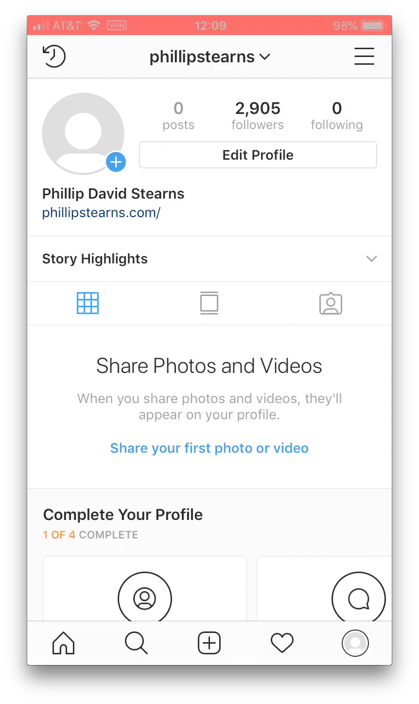
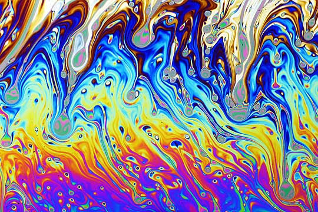
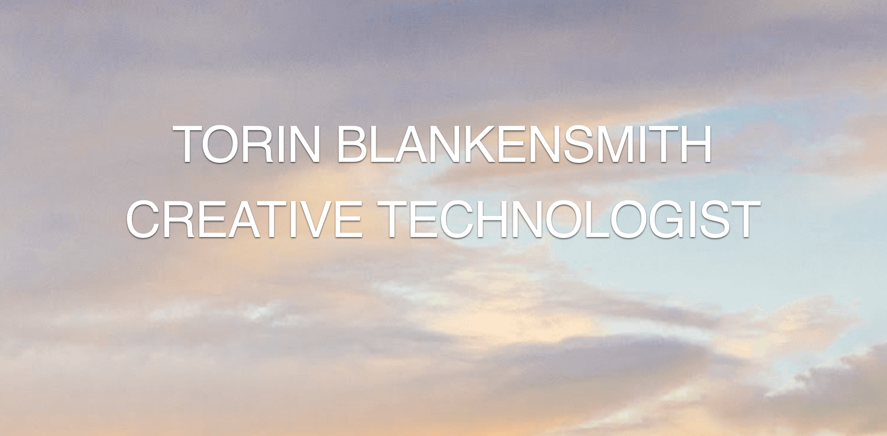

# Week 10

## Agenda

* Announcements
* Torin Blankensmith
* Image Manipulation: Pixel Sorting
* Research Presentation
* Vector Drifting
* Assignment 05

## Announcements

### UNSTAGRAM @ ON CANAL



**Location:** 312–322B Canal, New York, NY<br>
**Date:** Thursday, April 11th (opening) - May

I'm premiering versions of new video works made especially for WALLPLAY's ON CANAL project. These pieces are a deeply personal glimpse into my social media habits of late.

####From WALLPLAY's newsletter:

>"We're switching out our screen installations across 312–322B Canal this month to showcase a new set of digital interventions. Notable among them is a video piece called Unstagram by interdisciplinary artist Phillip David Stearns.

>Unstagram is a multi-channel screen capture of the artist "bleaching" his instagram account by deleting all posts, archives, likes and followers."

### MOTION CONTROL for TAUBA AUERBACH @ THE ARTIST'S INSTITUTE



**Location:** The Artist’s Institute, Hunter College, 132 E. 65th Street, New York New York 10065<br>
**Date:** April 12 (opening 6-8pm)–June 1, 2019

For the past two weeks, I've had the great pleasure and honor to work with a personal art heroine of mine: Tauba Auerbach. For her latest exhibition at Hunter College's Artist's Institute, I've developed a motion control solution for her first robotic/kinetic sculpture.

From theartistsinstitute.org:

>"Rather than picturing the rhythms of fluids and forms, the sculptures are themselves dynamic, allowing a set of key gestures to unfold over time. A soap film fills the central opening of a mechanism referencing Auerbach’s fascination with fascia (the meshwork of connective tissue that surrounds muscles, organs, glands, and blood vessels) and the interstitium (the newly discovered structure of fluid-filled compartments that extends throughout the body and constitutes one of its largest organs)."

## Torin Blankensmith




## Pixel Sorting


image source: [https://ayearincode.tumblr.com/archive](https://ayearincode.tumblr.com/archive)

### [Pixel Sorting Notes](https://github.com/pds-nyu-idm-cc/DM-GY-6063-Creative-Coding-Spring-2019-Stearns/blob/master/wk10/pixelsorting.md)

## Research Presentation

```
String[] subjects = { "clickclickclick.click", "Martin Wattenberg", "Nonotak" };
Presenter taoZhang = new Presenter(subjects);

taoZhang.setQtySubjects(2);
taoZhang.givePresentation();
```

## Vector Drifting (Datamoshing)


image source: [https://ayearincode.tumblr.com/archive](https://ayearincode.tumblr.com/archive)

### [Vector Drifting (Datamoshing) Notes](https://github.com/pds-nyu-idm-cc/DM-GY-6063-Creative-Coding-Spring-2019-Stearns/blob/master/wk10/datamoshing.md)

## Assignment 05

### Image Manipulation

Show off your image manipulation skills. Make the wildest image filter that all the kids will be using for their insta selfies.

**Use a minimum of 3 of the following:**

* pixel sorting
* cut and paste
* scaling
* `filter()`
* direct pixel array access
* use of `red()`, `green()`, `blue()`, `alpha()`, `brightness()`, `saturation()`, `hue()`;

**Make it interactive via 1 of the following:**

* mouse
* key presses
* sound
* video

**Make it output an image or image sequence using one of the following techniques:**

* `Pimage.save()`
* `PGraphic.save()`
* `saveFrame()`
* save to PDF?

**Resources:**

* [Brightness](https://processing.org/examples/brightness.html)
* [Blur](https://processing.org/examples/blur.html)
* [Convolution (edge detection)](https://processing.org/examples/edgedetection.html)
* [Transparency](https://processing.org/examples/transparency.html)
* [Alpha Mask](https://processing.org/examples/alphamask.html)
* [Create Image](https://processing.org/examples/createimage.html)
* [Pointilism](https://processing.org/examples/pointillism.html)
* Basically any of the Processing examples having to do with image and pixel manipulation!